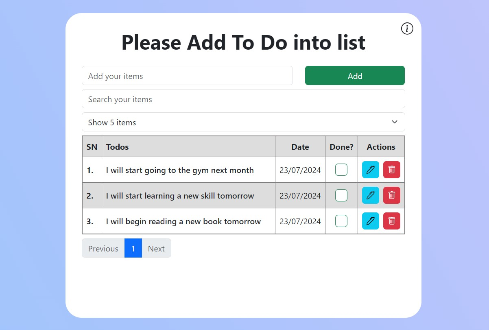

# AngularJS To-Do Application

[Check out my live website!](https://abuzaid-todo-ng.netlify.app/)

This is a simple To-Do application built with AngularJS and Bootstrap. The app allows users to add, edit, and remove tasks, and also track the completion status of each task.

## Features

- **Add**: Add new tasks to the list.
- **Edit**: Update existing tasks.
- **Remove**: Delete tasks from the list.
- **Mark as Completed**: Check off tasks to mark them as completed.
- **Filter**: Search tasks based on keywords.
- **Pagination**: Navigate through tasks with pagination.
- **Local Storage**: Tasks are saved in the browser's local storage to persist across page reloads.

## Screenshots

 

## Getting Started

To run the application locally, follow these steps:

1. **Clone the Repository**

   ```bash
   git clone https://github.com/Abuzaid98/to-do__angular-js.git
   cd to-do__angular-js
